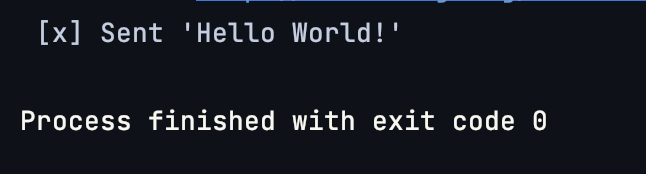
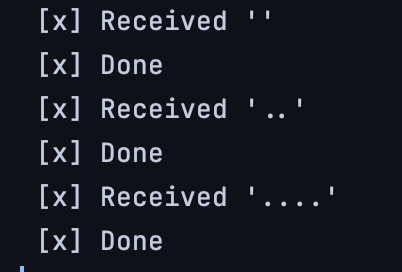
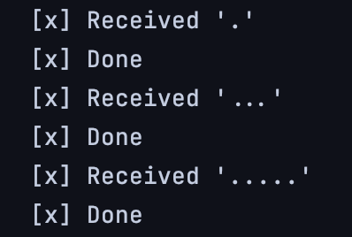

### Experiment 1: Installation
Chose to do the local installation

### Experiment 2: Hello World
Code: 
 
[Receive](https://github.com/vetlemknutsen/DAT250_RabbitMQ/blob/main/src/main/java/org/example/hello_world/Recv.java)
 
[Send](https://github.com/vetlemknutsen/DAT250_RabbitMQ/blob/main/src/main/java/org/example/hello_world/Send.java)

Sending hello world: 
 

 

Receiving hello world: 

### Experiment 3: Work Queues
Code: 
 
[NewTask](https://github.com/vetlemknutsen/DAT250_RabbitMQ/blob/main/src/main/java/org/example/work_queues/NewTask.java)
 
[Worker](https://github.com/vetlemknutsen/DAT250_RabbitMQ/blob/main/src/main/java/org/example/work_queues/Worker.java)

Worker 1 receives first, third and fifth tasks:
 

 
Worker 2 receives second, fourth and last tasks:
 

### Experiment 4: Topics
Code: 
 
[EmitLog](https://github.com/vetlemknutsen/DAT250_RabbitMQ/blob/main/src/main/java/org/example/topics/EmitLog.java)
 
[ReceiveLogs](https://github.com/vetlemknutsen/DAT250_RabbitMQ/blob/main/src/main/java/org/example/topics/ReceiveLogs.java)

### Issues
Encountered some problems when trying to run the program as i missed
some dependencies and I had to refresh maven. After that, everything went smooth. 